<div align="center">

<!-- We'll keep your header SVG -->


<!-- Typing SVG for dynamic welcome message -->
[](https://git.io/typing-svg)

# 🚀 Welcome to My Digital Universe! 

<table>
<tr>
<td width="50%">
<h3>💫 About Me</h3>

- 🔭 Currently crafting web experiences with React & Laravel
- 🌱 Deep diving into Python, Machine Learning & Cloud Architecture
- 👯 Looking to collaborate on innovative open-source projects
- 🎮 Gaming enthusiast & tech explorer
- 🎯 Goal: Contributing to projects that make a difference
- 💡 Always learning, always growing
</td>
<td width="50%">

### 🎯 Current Focus

```javascript
const currentStack = {
    frontend: ['React', 'TailwindCSS', 'JavaScript'],
    backend: ['Laravel', 'Python', 'MongoDB'],
    learning: ['Machine Learning', 'Cloud Architecture'],
    passions: ['Open Source', 'Gaming', 'Web3'],
    funFact: 'I code better with music! 🎵'
};
```
</td>
</tr>
</table>

### 🌟 Featured Projects

<table>
<tr>
<td width="33%">
<h3 align="center">Project 1</h3>
<div align="center">
<a href="PROJECT_LINK" target="_blank"></a>
<p>
<a href="PROJECT_LINK" target="_blank">

</a>
<a href="DEMO_LINK" target="_blank">

</a>
</p>
<p><strong>React, TailwindCSS, Laravel</strong> - Your amazing project description here</p>
</div>
                                                                                      
</td>
<td width="33%">
<!-- Add more projects similarly -->
</td>
</tr>
</table>

### 💻 Tech Arsenal

<details>
<summary>Frontend Magic 🎨</summary>
<br>


</details>

<details>
<summary>Backend Prowess 💪</summary>
<br>


</details>

<details>
<summary>Tools & Platforms 🛠️</summary>
<br>


</details>

### 🎮 Gaming Hub

<table>
<tr>
<td width="50%">

#### Current Favorites 🎯
- 🎮 Cyberpunk 2077
- ⚔️ The Witcher 3
- 🏃‍♂️ Apex Legends
- 🚗 Forza Horizon 5

</td>
<td width="50%">

#### Gaming Profiles 🎯
[](YOUR_STEAM_PROFILE)
[](YOUR_XBOX_PROFILE)
[](YOUR_EPIC_PROFILE)

</td>
</tr>
</table>

### 📊 GitHub Analytics

<p align="center">
<a href="https://github.com/volfir1">
  
  
</a>
</p>

<p align="center">
  
</p>

### 🎵 Currently Vibing To
[](https://github.com/kittinan/spotify-github-profile)

### 💡 Daily Dev Quote


### 🤝 Let's Connect

<p align="center">
<a href="YOUR_LINKEDIN"></a>
<a href="YOUR_TWITTER"></a>
<a href="https://instagram.com/_eilst_"></a>
<a href="https://reddit.com/user/Sparking20"></a>
</p>

---

<p align="center">

</p>

<!-- Snake animation -->


</div>
